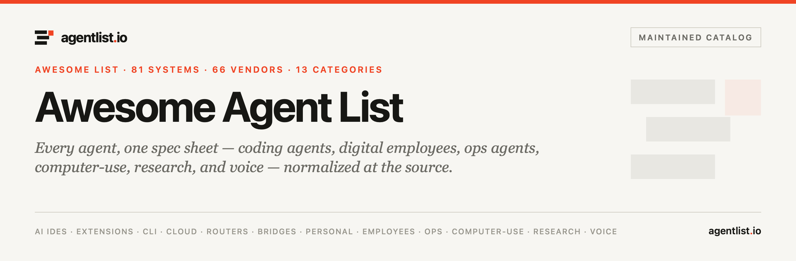

	 
	
	 
	 
	

		
		
		
	

	 
	<h3><a href="https://www.agentlist.io">agentlist.io</a> — awesome personal assistants</h3>
	Self-hosted personal agents, the projects built for them, and the projects built with them. Entries link vendor sources plus an agentlist.io spec sheet where the catalog covers them.
	 
	 
	

		<a href="https://www.agentlist.io/categories/personal-agent">Personal-agent category</a>&nbsp;&nbsp;&nbsp;
		<a href="https://www.agentlist.io/articles/personal-agent-landscape-x">The 2026 landscape write-up</a>&nbsp;&nbsp;&nbsp;
		<a href="https://www.agentlist.io/transports">Channels</a>&nbsp;&nbsp;&nbsp;
		<a href="https://www.agentlist.io/feed.xml">RSS</a>
	

> The personal-assistant shape converged in 2025–2026: one always-on process on your own hardware, reachable over the chat apps you already use, with memory, skills, and permission to act. This list collects the platforms, the skills and memory layers people build **for** them, and the companion projects built **with** them. Entries are editorial records, not endorsements — some carry a `(caution)` flag where the security story is still settling.

## Contents

- [Assistant platforms](#assistant-platforms)
- [Skills &amp; extensions](#skills--extensions)
- [Memory &amp; personalization](#memory--personalization)
- [Companions &amp; model wiring](#companions--model-wiring)
- [Hosted &amp; cowork surfaces](#hosted--cowork-surfaces)
- [Tools &amp; safe execution](#tools--safe-execution)

## Assistant platforms

*The cores — one gateway, many channels, persistent memory.* The [personal-agent category](https://www.agentlist.io/categories/personal-agent) tracks these.

- [OpenClaw](https://github.com/openclaw/openclaw) - Category-defining self-hosted assistant: one Gateway on your own hardware connects ~29 chat channels to an agent with memory, skills, sessions, and multi-agent routing. MIT, stewarded by an independent 501(c)(3) · [spec](https://www.agentlist.io/systems/openclaw) 
- [Hermes Agent](https://github.com/NousResearch/hermes-agent) - Nous Research's self-improving assistant — a closed learning loop creates skills from experience and refines them in use, with agent-curated memory and FTS5 session search. Runs from a $5 VPS up · [spec](https://www.agentlist.io/systems/hermes-agent) 
- [NanoClaw](https://github.com/qwibitai/nanoclaw) - TypeScript OpenClaw fork built for isolation — each agent runs in its own container, with Agent Swarms for multi-agent collaboration · [spec](https://www.agentlist.io/systems/nanoclaw) 
- [ZeroClaw](https://github.com/zeroclaw-labs/zeroclaw) - Rust rewrite of the personal-agent shape — a single binary under ~5MB RAM, ~20 model providers, 30+ channels, OS-level sandboxes, GPIO/I2C/SPI for real hardware · [spec](https://www.agentlist.io/systems/zeroclaw) 
- [PicoClaw](https://github.com/sipeed/picoclaw) - Sipeed's Go rewrite for embedded — one binary that cold-starts in under a second inside ~10MB of RAM on single-board computers · [spec](https://www.agentlist.io/systems/picoclaw) 
- [nanobot](https://github.com/HKUDS/nanobot) - HKUDS's compact, MCP-native Python assistant codebase you can audit in an afternoon — popular as a learning platform and a base for custom assistants · [spec](https://www.agentlist.io/systems/nanobot) 
- [Leon](https://github.com/leon-ai/leon) - The veteran open-source personal assistant — Node/Python, offline-capable, modular skills, self-hosted since 2017 
- [Khoj](https://github.com/khoj-ai/khoj) - Self-hosted personal AI that searches and chats over your notes (Obsidian, markdown, PDFs) with automations and multiple model backends 
- [Agent Zero](https://github.com/frdel/agent-zero) - Terminal-native personal agent framework — grows its own tools, runs in Docker, treats the OS as its environment 
- [AstrBot](https://github.com/AstrBotDevs/AstrBot) - Agent assistant & development framework that bridges many IM platforms (QQ, WeChat, Telegram, Discord) to LLM agents 
- [CowAgent](https://github.com/zhayujie/CowAgent) - Open-source super-assistant harness — plans tasks, runs tools and skills, popular in the WeChat/ecosystem bot scene 
- [OpenVoiceOS](https://github.com/OpenVoiceOS/ovos-core) - Community-run voice-assistant stack (Mycroft successor) for embedded and desktop — fully offline-capable 
- [OpenInstinct](https://github.com/Merit-Systems/OpenInstinct) - iMessage personal assistant with a password vault — a smaller, opinionated take on the Mac-resident agent 

## Skills &amp; extensions

*Built for the platforms — what the assistants learn to do.*

- [Awesome OpenClaw Skills](https://github.com/VoltAgent/awesome-openclaw-skills) - The community collection of OpenClaw skills — thousands filtered and categorized, the biggest extension index for the ecosystem 
- [ClawHub](https://github.com/openclaw/clawhub) - OpenClaw's official skills registry — publish, version, and install skills the assistant loads at runtime 
- [Obsidian Skills](https://github.com/kepano/obsidian-skills) - Agent skills for Obsidian — teach your assistant to drive the Obsidian CLI and open formats, by the Obsidian CEO 
- [last30days-skill](https://github.com/mvanhorn/last30days-skill) - A single well-made skill that researches any topic across Reddit, X, YouTube, HN, and prediction markets — the canonical example of skill-as-expertise 

## Memory &amp; personalization

*The layer people keep rebuilding — profiles, patterns, and recall across sessions.*

- [Instinct](https://www.agentlist.io/systems/instinct) - Self-learning memory MCP server for coding agents **(caution)** — observes repeated patterns, scores them by confidence, promotes mature ones into suggestions it exports back to Claude Code, Cursor, Windsurf, Codex, and CLAUDE.md · [spec](https://www.agentlist.io/systems/instinct)
- [claude-mem](https://github.com/thedotmack/claude-mem) - Persistent context across sessions for every agent — captures what your assistant does and compresses it into searchable memory 
- [Mem0](https://github.com/mem0ai/mem0) - The memory layer for agents — extract, store, and retrieve user-and-agent memories across sessions, as open-source SDK or hosted API · [spec](https://www.agentlist.io/systems/mem0) 

## Companions &amp; model wiring

*Assistant-shaped projects built around a specific model or persona — the Grokbot pattern: pick a frontier model, give it a face and a channel.*

- [Airi](https://github.com/moeru-ai/airi) - Self-hosted, you-owned Grok companion — a container of souls of waifu, cyber living, with voice, live2d/vrm avatars, and Minecraft play. The flagship example of a model-locked companion bot 

> Most platforms above are provider-agnostic: point them at xAI's Grok endpoint (or any OpenAI-compatible API) and you get a "grokbot" without a dedicated project. Muse — Meta's internal employee assistant reportedly inspired by OpenClaw — is closed; the public analogues are in the next section.

## Hosted &amp; cowork surfaces

*Taking the assistant off the home server, or giving it a desk.*

- [moltworker](https://github.com/cloudflare/moltworker) - Cloudflare's proof of concept: OpenClaw adapted to run on Workers — the shape survives leaving the Mac mini, though running costs shift to usage-based 
- [AionUi](https://github.com/iOfficeAI/AionUi) - Open-source 24/7 cowork app for OpenClaw, Hermes, Claude Code, Codex, and friends — a desktop UI for managing always-on agents 

## Tools &amp; safe execution

*What the assistant reaches for — and what keeps it from burning the house down.*

- [E2B](https://github.com/e2b-dev/E2B) - Secure sandboxes for agent-generated code — instant isolated VMs where the assistant can run untrusted code without touching your machine · [spec](https://www.agentlist.io/systems/e2b) 
- [Composio](https://github.com/ComposioHQ/composio) - Tool-and-integration platform — hundreds of SaaS tools (Gmail, Slack, GitHub, Linear) exposed to agents with managed auth and consistent schemas · [spec](https://www.agentlist.io/systems/composio) 

---

*Maintained alongside the [agentlist.io](https://www.agentlist.io) catalog — cataloged entries link a `spec` record; ecosystem projects link straight to source. Additions and corrections go through [CONTRIBUTING.md](CONTRIBUTING.md). Entries are editorial records, not endorsements or paid placements. [CC0](LICENSE).*
